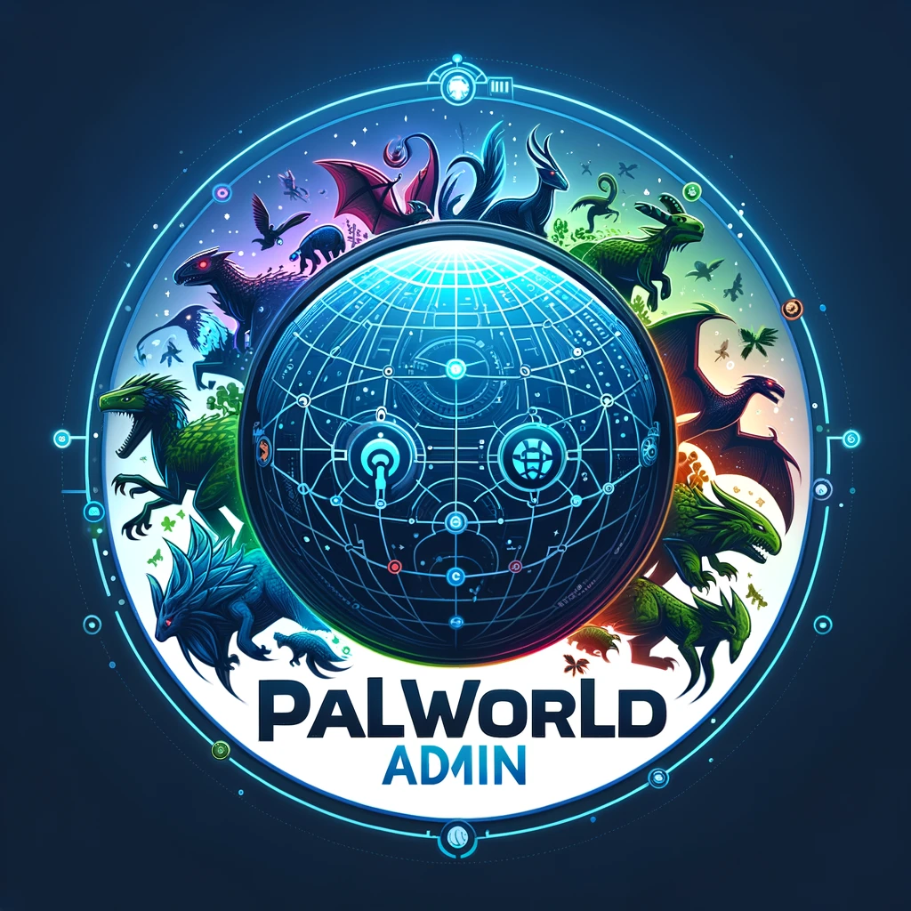

<br/>
<p align="center">
  <a href="https://github.com/derkalle4/python3-palworld-rcon">
    
  </a>

  <h3 align="center">Palworld RCON</h3>

  <p align="center">
    Automate your Palworld server the easy way
    <br/>
    <br/>
    <a href="https://github.com/derkalle4/python3-palworld-rcon"><strong>Explore the docs »</strong></a>
    <br/>
    <br/>
    <a href="https://github.com/derkalle4/python3-palworld-rcon/issues">Report Bug</a>
    .
    <a href="https://github.com/derkalle4/python3-palworld-rcon/issues">Request Feature</a>
  </p>
</p>

      

## Table Of Contents

* [About the Project](#about-the-project)
* [Built With](#built-with)
* [Getting Started](#getting-started)
  * [Prerequisites](#prerequisites)
  * [Installation](#installation)
* [Usage](#usage)
* [Roadmap](#roadmap)
* [Contributing](#contributing)
* [License](#license)
* [Authors](#authors)
* [Acknowledgements](#acknowledgements)

## About The Project

This repository aims to be an automated solution for your Palworld server. You can design your own plug-ins and schedules as you like.

## Built With

* [Python 3](https://www.python.org/downloads/)
* [mccron](https://github.com/Tiiffi/mcrcon)
* [schedule](https://schedule.readthedocs.io/en/stable/)

## Getting Started

To get a local copy up and running follow these simple example steps:

### Prerequisites

Please install the following for your distribution (Windows may work but it is untested):

* latest Python3
* Python3 Virtual Env

### Installation

1. Clone the repo

```sh
git clone https://github.com/derkalle4/python3-palworld-rcon.git
```

2. Create virtual environment and install all dependencies

```sh
./create_venv.sh
```

## Usage

If you used the ./create_venv.sh you should use this command to run the app:

```sh
./run_in_venv.sh
```
If you do not use a virtual environment the command will look like this:

```sh
python3 .\app.py
```

### create a config.yaml

The whole tool is managed by the config.yaml. If not created already, simply copy the config.example.yaml or create a new config.yaml in the root directory of this project.

#### App configuration

You will need the app configuration section where you can set the log level of this tool. Default is info, but you can change it to error as well as debug to get less or quite a lot more information for debugging purposes.

```yaml
app:
  log_level: info
```

#### Web configuration

Because Palworld does not have a good query client currently you can use this integrated web server to grab information about your server. Simply add this part to your config file and set an unused port. If you omit this configuration part no web server will be started. You shouldn't make this port publically available! It is not secured whatsoever...

```yaml
web:
  port: 8214
```

#### Gameserver configuration

This is the main part of this tool. You can add as many gameserver as you want. Each server needs to have a set IP address, RCON query port and a password.

```yaml
gameserver:
  - ip: 127.0.0.1
    query_port: 25575
    rcon_password: yoursecurepasswordhere
    schedules:
```

But what whould a server connection do without anything useful? Let's find out what you can do further because we're about to add some schedules to the given server.

##### Example RCON command: Broadcast messages to the global player chat

You can send any kind of RCON command with any kind of arguments to the gameserver. Each of this commands will be executed according to a schedule which you can define by yourself. This tool will execute it with a small delay of some seconds depending on the amount of servers you handle concurrently.

Hint: it is a good option to comment your work, the yaml file could get quite big.

In this example the given command to the server is "broadcast". It could be anything that the Palworld server supports. The arguments can also be anything this command requires. For the given command it is simply text. Be aware that currently the Palworld server does not like spaces, therefore each space has to be replaced with an underscore.

```yaml
      - command: broadcast
        arguments: "Attention:_Daily_Server_Update_Check_At_4am!"
        every:
```

But when should this command run? Because we utilize a scheduler (see above in the built with Section) you can run it at any given time. This needs to go to the "every" section of the config file. You can have as much schedules for a given command as you want. For example, to make it run everyday at 3:55am in the time zone Europe/Berlin:

```yaml
          - day:
            - at:
              - "03:55"
              - "Europe/Berlin"
```

You can easily swap day for second, minute, hour, day, week, month or year. This follows the syntax of the schedule Python library.

But what if you want to run your command every hour at a specific minute?

```yaml
          - hour:
            - at: ":16"
```

And what about if you want to run your command every X seconds?

```yaml
          - seconds: 5
```

Quite easy :) see the config.example.yaml for more information about syntax and use cases.

##### custom function

Only running static things would be a shame. You can easily create your own plugins and run them. Plugins can grab the output of the given command and do something with them. For example: building a player list and write a message to the server each time a player connects or disconnects from the server:

```yaml
      # welcome new players
      - command: ShowPlayers
        callback: playerstatus.announce_player
        every:
          - seconds: 5
```

In this case we're running the command to return all players on the server. There is a callback config key where you have two sections: playerstatus is the name of the python file in the plugins folder, and also the name of the class (see the example plugin in the plugins directory). The announce_player part is the function to run. it get the connection to the server and the response of the runned command to further work with it.

One cool thing is that every plugin class could also give it's information to the integrated web server. This way you can grab all the information you want from this tool. In my case this is the amount of players online and a list of all players which I use in my public Monitoring you find at https://status.kandru.de :)

Please share your created plugins with the Community!

## Roadmap

Feel free to contribute following the roadmap

* [ ] use types in every function
* [ ] better source code documentation
* [ ] split to multiple classes to make everything smaller and give a better overview
* [ ] re-implement mccron to avoid using a third-party library for the small percentage we need from it
* [ ] document how to properly use this rcon tool

## Contributing

Contributions are what make the open source community such an amazing place to be learn, inspire, and create. Any contributions you make are **greatly appreciated**.
* If you have suggestions for adding or removing projects, feel free to [open an issue](https://github.com/derkalle4/python3-palworld-rcon/issues/new) to discuss it, or directly create a pull request after you edit the *README.md* file with necessary changes.
* Please make sure you check your spelling and grammar.
* Create individual PR for each suggestion.
* Please also read through the [Code Of Conduct](https://github.com/derkalle4/python3-palworld-rcon/blob/main/CODE_OF_CONDUCT.md) before posting your first idea as well.

### Creating A Pull Request

1. Fork the Project
2. Create your Feature Branch (`git checkout -b feature/AmazingFeature`)
3. Commit your Changes (`git commit -m 'Add some AmazingFeature'`)
4. Push to the Branch (`git push origin feature/AmazingFeature`)
5. Open a Pull Request

## License

Distributed under the GNU GENERAL PUBLIC License. See [LICENSE](https://github.com/derkalle4/python3-palworld-rcon/blob/main/LICENSE) for more information.

## Authors

* [Kalle Minkner](https://github.com/derkalle4) - *Project Founder*

## Acknowledgements

None so far
